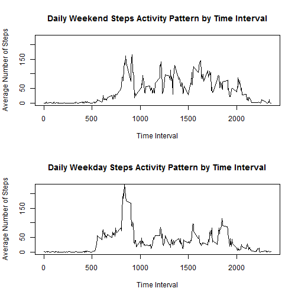

## Loading and preprocessing the data
Since the data is already stored in a .csv file, we need only call read.csv() to access it.

```r
data<-read.csv(file="activity.csv")
```


## What is mean total number of steps taken per day?
In order to see what the data look like, we created a histogram of the total number of steps taken each day, excluding missing values.

```r
stepsbyday<-aggregate(data$steps,by=data["date"],FUN=sum,na.rm=T)
hist(stepsbyday$x,xlab="Daily Steps",main="Histogram of Daily Steps")
```

 

Then we can compute the mean and median of the number of daily steps

```r
mn<-mean(stepsbyday$x,na.rm=T)
md<-median(stepsbyday$x,na.rm=T)
```

The mean of the number of steps taken per day is 9354.23 and the median is 10395. These numbers appear to be consistent with our histogram.

## What is the average daily activity pattern?

To examine the average daily activity, we can look at the average number of steps taken in each 5 minute interval over all of the days in the data.


```r
stepsbyint<-aggregate(data$steps,by=data["interval"],FUN=mean,na.rm=T)
plot(stepsbyint$interval,stepsbyint$x,type="l",xlab="Time Interval",ylab="Average Number of Steps",main="Daily Steps Activity Pattern by Time Interval")
```

 

There are some interesting peaks at various times of the day but it makes sense that very few steps are taken at the beginning and end of the day, when individuals are likely asleep.


```r
maxint<-stepsbyint$interval[which(stepsbyint$x==max(stepsbyint$x,na.rm=T))]
maxsteps<-max(stepsbyint$x,na.rm=T)
```

On average the most steps, 206.1698, are taken during the interval between 835 and 840. This is likely when many people are commuting to work.

## Imputing missing values

Our data has missing values which may introduce bias.


```r
numna<-sum(is.na(data))
```

The data contain 2304 missing values.

To impute these missing values, we propose using the average number of steps for the missing 5 minute interval over the rest of the entire data set. This will make the new synthetic replacement data consistent with the existing daily trends.


```r
newdata<-data
badind<-which(is.na(data$steps))
badint<-data[badind,3]
for (i in 1:length(badint)){
  s<-stepsbyint$x[stepsbyint$interval==badint[i]]
  newdata$steps[badind[i]]=s
}

newstepsbyint<-aggregate(newdata$steps,by=newdata["interval"],FUN=mean,na.rm=T)

newna<-sum(is.na(newdata))
newstepsbyday<-aggregate(newdata$steps,by=newdata["date"],FUN=sum,na.rm=T)
newmn<-mean(newstepsbyday$x,na.rm=T)
newmd<-median(newstepsbyday$x,na.rm=T)
```

Now we can examine a histogram of the new imputed data with no missing values.


```r
hist(newstepsbyday$x,xlab="Daily Steps",main="Histogram of Daily Steps Using New Imputed Data Set")
```

 

The mean and median of the new imputed data set are 10766.19 and 10766.19, respectively. Both the mean and the median increased after we imputed new data. This makes sense since the number of days remains the same but we are adding steps to 2304 intervals that were previously missing data.


## Are there differences in activity patterns between weekdays and weekends?

There may be differences in activity patterns between weekdays and weekends. We would expect people to be more active during the day time on the weekend because many people will not be going to their regularly weekday job.


```r
df<-data.frame(newdata)
df$day<-weekdays(as.Date(df$date))

df$weekend<-NA
we<-c("Saturday","Sunday")
df$weekend<-df$day %in% we
stepsbyintwe<-aggregate(df$steps,by=df[c("interval","weekend")],FUN=mean,na.rm=T)
```

We can plot the weekday activity and the weekend activity patterns to compare and identify differences.


```r
par(mfrow=c(2,1))
plot(stepsbyintwe$interval[stepsbyintwe$weekend==TRUE],stepsbyintwe$x[stepsbyintwe$weekend==TRUE],type="l",
  xlab="Time Interval",ylab="Average Number of Steps",main="Daily Weekend Steps Activity Pattern by Time Interval", ylim=c(0,225))

plot(stepsbyintwe$interval[stepsbyintwe$weekend==FALSE],stepsbyintwe$x[stepsbyintwe$weekend==FALSE],type="l",
  xlab="Time Interval",ylab="Average Number of Steps",main="Daily Weekday Steps Activity Pattern by Time Interval", ylim=c(0,225))
```

 

It appears the pattern for weekend stepping is clearly different from the weekday behavior. The morning peak is shorter and the steps are more evenly distributed throughout the day. There also appears to be more variability which may be attributable to varying weekend activities.
